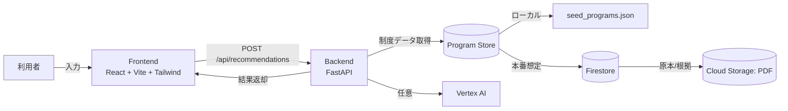

---
title: "AI補助金ナビ: 申請判断を支える根拠提示型サービス"
emoji: "🧭"
type: "tech"
topics: ["gch4", "fastapi", "gcp", "vertexai", "rag"]
published: false
---

## 概要
AI補助金ナビは、自治体の給付金/補助金を「自分に関係あるか」を最短で判断できるようにする、根拠提示型の診断Webアプリです。最小限の入力から、**該当可能性・信頼度・理由・期限・最初にやること・根拠資料の抜粋**までを一度に提示し、迷いを減らします。

**デモ動画（約3分）**

https://www.youtube.com/watch?v=REPLACE_ME

※ `REPLACE_ME` を動画IDに差し替えてください。

**このアプリの強み**
- 透明性: 根拠資料のページ/URL/抜粋を必ず表示
- 迷わないUX: 入力 → 一覧 → 詳細の3ステップ導線
- グレーゾーンへの配慮: 「対象外の可能性」と次の行動を同時に提示

## 背景
補助金・給付金の情報は自治体ごとに更新頻度や形式が異なり、PDF/HTML/紙資料が混在しています。
結果として「自分が対象かどうか」「何から始めればよいか」を判断するコストが高く、**申請前の段階で諦めてしまう**ケースが生まれやすい状況でした。

| 現状（Before） | 目指す姿（After） |
| --- | --- |
| PDFやWebを探し回る | 最小入力で該当可能性を一覧化 |
| 対象/対象外の判断が曖昧 | 理由と根拠で判断の裏付けを提示 |
| 申請行動が分からない | 最初にやることまで具体化 |

## プロジェクト概要
### 対象ユーザー
- 自治体の給付金・補助金に興味はあるが条件判断が難しい住民/世帯
- 申請可否の一次判断を素早く行いたい自治体窓口・支援団体

### 解決する課題
- 制度情報が分散し、条件の読み解きに時間がかかる
- 対象/対象外の判断が曖昧で、申請の手間と不安が大きい
- 期限・必要書類など「最初の行動」が分からない

### ソリューションの特徴
- **最小入力**で該当可能性と信頼度を提示
- 理由と根拠資料を**ワンセット**で提示し、判断の裏付けを可視化
- 対象外の可能性がある場合も「条件に近づくための行動」を提案
- ルールベース判定を軸に、Vertex AIのLLM出力を**任意で上書き**できる設計

## 体験フロー
1. 利用者が年齢/年収/世帯/職業などを入力
2. 条件に近い補助金が「信頼度」と短い理由付きで一覧表示
3. 詳細画面で「理由・期限・最初にやること・根拠資料」を確認
4. 根拠と行動が揃った状態で申請準備に進める

## 主要機能
- **入力フォーム**: 年齢・年収・世帯・職業・扶養人数・市区町村
- **一覧表示**: 該当可能性（High/Medium/Low/Unknown）と信頼度、短い理由
- **詳細画面**: 理由/期限/最初にやること/根拠資料の抜粋を提示
- **グレーゾーンガイド**: 条件未達時でも次に取る行動を提案

## システムアーキテクチャ


**データフローの要点**
- 入力はバックエンドへ送信し、プログラムデータを取得
- ルールベースで判定しつつ、必要に応じてLLM結果で上書き
- 根拠資料（ページ/URL/抜粋）を含めて返却

## データ/AI設計
### データモデル（制度情報）
制度データは以下の情報を持ちます。
- **eligibility**: 年齢/収入/世帯/扶養/職業などの条件
- **todo_steps**: 申請時に最初にやる行動
- **gray_zone_guidance**: 条件未達時のガイド
- **evidence**: ページ番号/URL/抜粋

### 判定ロジック（ルールベース）
- 条件一致率（matched / total_checks）からスコアを算出
- スコアに応じて `high / medium / low / unknown` を決定
- 信頼度は `0.4 + 0.6 * score` で計算
- `high` でない場合は灰色地帯のガイドを追加

### LLM連携とフォールバック
- `USE_VERTEX_AI=true` の場合、Vertex AI の結果を優先
- JSONスキーマに合わない出力は破棄し、ルールベースに自動フォールバック
- LLMの出力形式は `/api/llm/format` で確認可能

### 根拠提示の設計
- 理由・期限・TODOすべてに `evidence_ref` を紐付け
- UI側で「根拠資料のページ/URL/抜粋」を表示
- 結論だけでなく判断根拠を必ず可視化

## APIとデータモデル
**主要API**
- `POST /api/recommendations`: 入力に対する補助金推薦
- `GET /api/programs/{program_id}`: 詳細取得
- `GET /api/llm/format`: LLM出力フォーマット

**入力例**
```json
{
  "age": 25,
  "income_yen": 3200000,
  "household": 2,
  "occupation": "会社員",
  "dependents": 0,
  "municipality": "○○市"
}
```

**出力例（抜粋）**
```json
{
  "municipality": "○○市",
  "results": [
    {
      "program_id": "city_young_single_001",
      "program_name": "○○市 若年単身者支援金",
      "level": "high",
      "confidence": 0.82,
      "reasons": [
        {"text": "対象年齢に該当する", "evidence_ref": 0}
      ],
      "deadline": {"date": "2026-02-28", "evidence_ref": 1},
      "todo": [
        {"text": "学生証または本人確認書類を準備する", "evidence_ref": 2}
      ],
      "evidence": [
        {"page": 2, "source_url": "...", "snippet": "..."}
      ]
    }
  ],
  "meta": {"model": "gcp-vertex-optional", "version": "mvp-0.1"}
}
```

## 技術スタック
### フロントエンド
- React + TypeScript (Vite)
- Tailwind CSS

### バックエンド
- FastAPI
- Pydantic（スキーマ/バリデーション）

### データ/AI
- ローカルJSON（デモ/検証）
- Firestore / Cloud Storage（本番想定）
- Vertex AI（任意）

## 実装のポイント
1. **透明性重視のUX**
   - すべての判断に根拠を紐付け、結論だけを返さない

2. **不確実性を前提とした設計**
   - 「対象外の可能性」を明記し、次の行動を提案

3. **LLMの安全な活用**
   - スキーマ検証で崩れた出力を排除
   - ルールベースの判定を常時保持

4. **探索性の高いUI構成**
   - 一覧で俯瞰 → 詳細で掘り下げる導線

5. **MVPの拡張性**
   - ローカルJSONで即デモ可能
   - Firestore/GCS/Vertex AIに段階移行できる構成

## 実装で苦労した点と解決策
### 1. LLM出力の揺らぎ
- **問題:** JSONが崩れる/フィールド欠落が起こりやすい
- **解決:** スキーマ検証で不正出力を破棄し、ルールベースへフォールバック

### 2. 根拠と理由の紐付け
- **問題:** 「なぜその結論か」が曖昧になりやすい
- **解決:** `evidence_ref` を理由/期限/TODOに紐付け、UIで根拠を常時表示

### 3. グレーゾーンの扱い
- **問題:** 条件未達でも「何が足りないか」が分からない
- **解決:** `gray_zone_guidance` を追加し、次に取る行動を提示

## 制約と注意点
- 現状のデータは `seed_programs.json` を用いた**仮データ**
- 最終的な申請可否は自治体の公式情報の確認が必須
- LLMの出力は不確実性を含むため、ルールベースと併用

## 今後の展望
- PDFから制度情報と根拠を自動抽出するパイプライン
- 自治体ごとの制度更新の自動検知と差分通知
- ユーザーごとの申請状況を管理できるマイページ
- 市区町村検索や条件保存などの利便性向上

## おわりに
AI補助金ナビは、**「申請できるかも」という曖昧さ**を減らし、根拠と行動をセットで提示することで、申請の第一歩を後押しするMVPです。透明性とUXを軸に、制度情報の複雑さを「行動に変える」体験へ変換することを目指しました。
